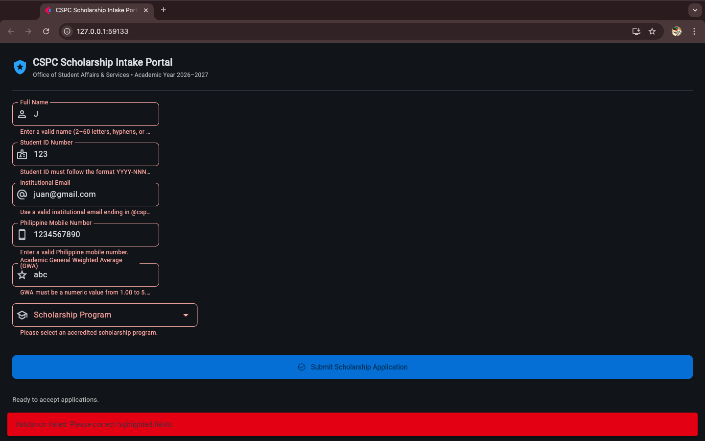
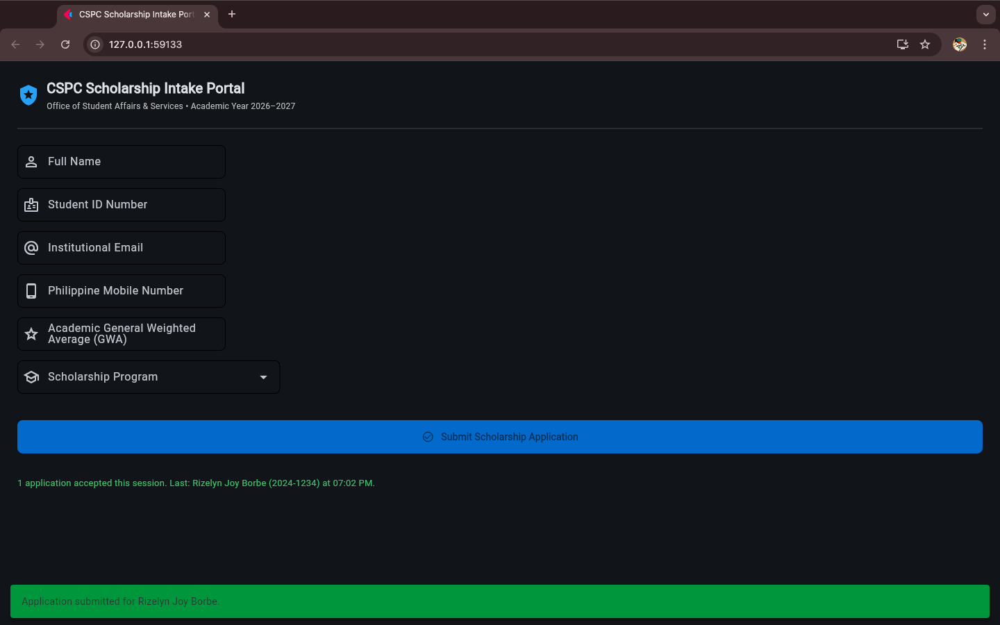

# CCCS 106 - Group Laboratory Task Submission: Form Validation & Defensive Programming

### 1. Group & Team Members Roster
- **Group Name / Number:** I-git
- **Year & Section:** BSCS 3A
- **Date of Submission:** 2026-09-30
- **Submitting Member:** Kelly Saldo

| Role / Order | Full Name | Student ID Number |	Institutional Email |	Key Technical Contribution |
| :---: | :--: | :---: | :-- | :--- |
| **Member 1** |	Kelly Saldo |	2411287 |	kesaldo@my.cspc.edu.ph	| Domain Validator Engine, Defensive Pipeline, & Documentation|
| **Member 2** |	Rizelyn Borbe |	2410605 |	riborbe@my.cspc.edu.ph |	Flet UI Reactive Error States & Documentation |
| **Member 3** |	Tristan Bisenio |	232000006 |	trbisenio@my.cspc.edu.ph	| Defensive Pipeline & Automated Testing |
| **Member 4** |	Nash Sabas |	2412117  |	sanash@my.cspc.edu.ph	| Regex & Domain Validator Engine |

### 2. Git Repository & Commit Verification
- **Dedicated GitHub Repository URL:** (https://github.com/kellysldo/cccs106-lab-form-validation-group12)
- **Repository Visibility:** Public
- **Final Verified Commit SHA on `main`:** [Paste 7-character or 40-character commit hash, e.g., a1b2c3d]

### 3. Automated Test Suite Output (`test_validation.py`)

Run `python test_validation.py -v` in your terminal and paste the full output block below:

```cmd

python test_validation.py -v
test_dataclass_contract_creation (__main__.TestScholarshipValidator.test_dataclass_contract_creation) ... ok
test_gui_submission_flow (__main__.TestScholarshipValidator.test_gui_submission_flow) ... ok
test_invalid_email_domain (__main__.TestScholarshipValidator.test_invalid_email_domain) ... ok
test_invalid_gwa_non_numeric (__main__.TestScholarshipValidator.test_invalid_gwa_non_numeric) ... ok
test_invalid_gwa_out_of_bounds (__main__.TestScholarshipValidator.test_invalid_gwa_out_of_bounds) ... ok
test_invalid_name_empty (__main__.TestScholarshipValidator.test_invalid_name_empty) ... ok
test_invalid_name_length_and_symbols (__main__.TestScholarshipValidator.test_invalid_name_length_and_symbols) ... ok
test_invalid_phone_numbers (__main__.TestScholarshipValidator.test_invalid_phone_numbers) ... ok
test_invalid_student_id_format (__main__.TestScholarshipValidator.test_invalid_student_id_format) ... ok
test_valid_email (__main__.TestScholarshipValidator.test_valid_email) ... ok
test_valid_gwa (__main__.TestScholarshipValidator.test_valid_gwa) ... ok
test_valid_name (__main__.TestScholarshipValidator.test_valid_name) ... ok
test_valid_phone_normalization (__main__.TestScholarshipValidator.test_valid_phone_normalization) ... ok
test_valid_student_id (__main__.TestScholarshipValidator.test_valid_student_id) ... ok

----------------------------------------------------------------------
Ran 14 tests in 0.160s

OK

```


### 4. Verification Screenshots
**A. Multi-Field Validation Error State (Matching Figure 1)**

_(Ensure red error borders, error descriptions, and red SnackBar are clearly visible)_


**B. Successful Application Registration State (Matching Figure 2)**

_(Ensure clean form fields, green SnackBar, and the session contract card are clearly visible)_


### 5. Technical Reflection & Engineering Audit
- **Defensive Error Handling:** [In 1–2 sentences, explain how the team's code prevents GUI crashes when non-numeric or malformed GWA inputs are entered.]
- **Multi-Tier Separation:** [In 1–2 sentences, explain why client-side Flet error clearing alone does not replace domain-tier validation.]
- **Team Collaboration Reflection:** [In 1–2 sentences, describe how your team coordinated branch merges, code reviews, or pairing to complete the validation pipeline.]
